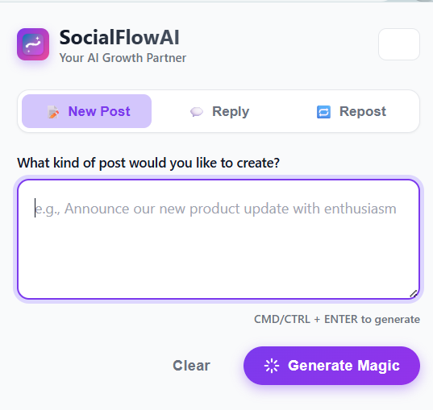
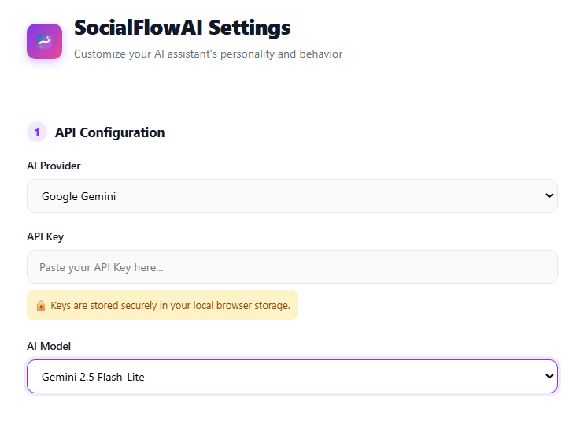
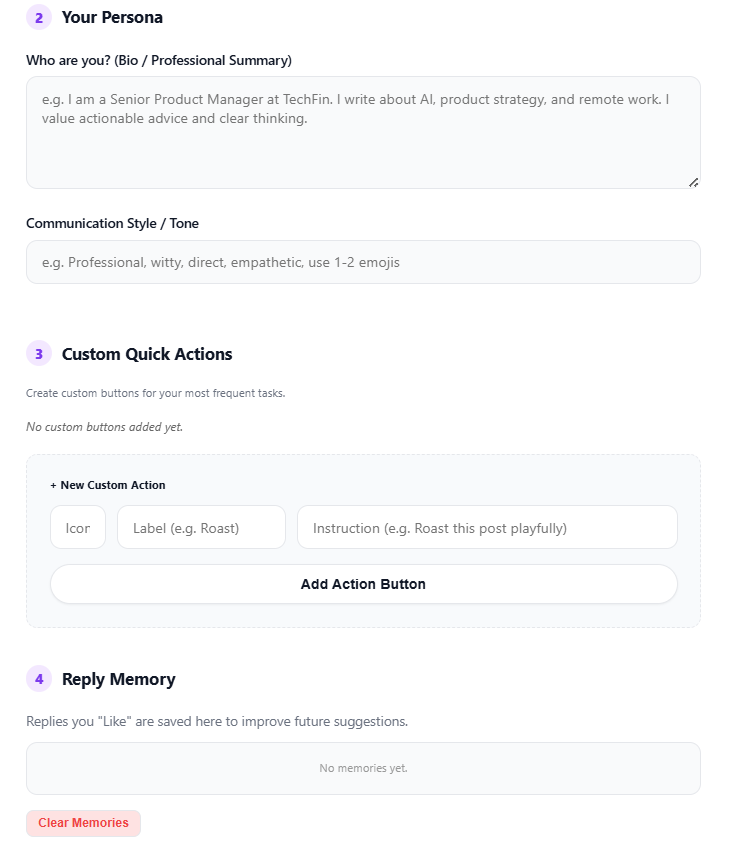
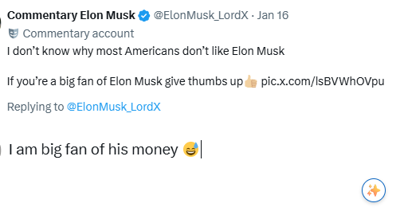
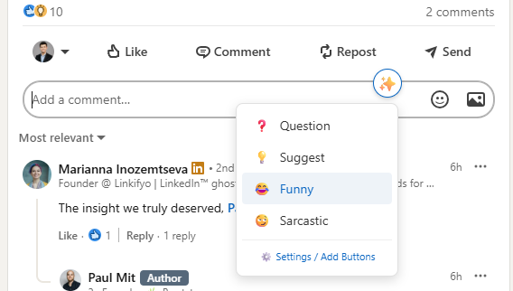
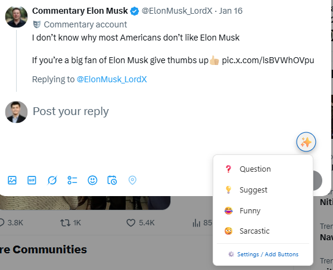

# SocialFlow AI 🚀

**SocialFlow AI** is a powerful Chrome Extension that supercharges your **LinkedIn** and **X (Twitter)** engagement using advanced AI (OpenAI & Google Gemini). It helps you write smart, context-aware comments, replies, and posts in seconds, tailored to *your* unique voice.



## ✨ Features

### 🧠 **Smart Context Awareness**
SocialFlow AI doesn't just write generic text. It reads the post you are replying to (including images!) to generate deeply relevant and insightful responses.
- **LinkedIn**: Understands long-form posts, articles, and nested comments.
- **X (Twitter)**: Reads tweets, threads, and quoted tweets to keep your replies on point.

### 🤖 **Dual AI Engine Support**
Choose your preferred AI powerhouse:
- **OpenAI**: Supports `GPT-5.2`, `GPT-4o`, `GPT-4o-mini`, and custom models. (Requires API Key).
- **Google Gemini (Free Tier)**: Supports `Gemini 2.5 Pro`, `Gemini 2.5 Flash` (Fast & Free/Low cost).

### 🎭 **Personalization & Memory (The "You" Factor)**
Make the AI sound exactly like you, never robotic.
- **User Bio**: Tell the AI who you are (e.g., "Senior React Developer," "Marketing Expert") to frame your expertise.
- **Tone Settings**: Define your style (e.g., "Professional but witty," "Casual and punchy").
- **Style Memory**: The extension "learns" from replies you like. When you save a generated reply, it's added to a memory bank and used as a style reference for future generations.

### ⚡ **One-Click Magic & Custom Actions**
- **Quick Buttons**: 
  - `❓ Question`: Ask a thoughtful question to drive engagement.
  - `💡 Suggest`: Offer value or a counter-point.
  - `😂 Funny`: Add humor to the conversation.
  - `� Sarcastic`: For when you need a bit of edge.
- **Custom Buttons**: Create your own buttons with specific prompts (e.g., "Roast this," "Summarize," "Disagree politely").
- **"Start a Post"**: A dedicated button to help you brainstorm and draft entirely new posts from scratch.

---

## �️ Installation

Since this is a developer preview/local version, you will install it as an "Unpacked Extension".

1.  **Clone/Download** this repository.
2.  **Build the Project** (if using the Next.js source):
    ```bash
    npx bun install
    npx bun run build
    ```
    This will create a `dist` folder with the compiled extension. 
    *(Note: If you just have the source files in `public`, you can skip the build step and load the `public` folder directly, but building is recommended).*
3.  Open Chrome and navigate to `chrome://extensions/`.
4.  Toggle **Developer mode** in the top right corner.
5.  Click **Load unpacked**.
6.  Select the `dist` folder (or `public` folder) from this project.
7.  The **SocialFlow AI** icon should appear in your toolbar!

---

## ⚙️ Configuration

Before using the extension, you need to set up your AI provider.




1.  Click the **SocialFlow AI icon** in your Chrome toolbar.
2.  Click the **Settings (⚙️)** icon in the popup.
3.  **Choose AI Provider**:
    *   **OpenAI**: Enter your [OpenAI API Key](https://platform.openai.com/api-keys).
    *   **Gemini**: Enter your [Google Gemini API Key](https://aistudio.google.com/app/apikey).
4.  **Personalize**:
    *   **User Bio**: "I am a software engineer passionate about AI."
    *   **Tone**: "Friendly, tech-savvy, helpful."
5.  Click **Save Settings**.

---

## 🚀 Usage

### on LinkedIn & X (Twitter)
1.  **Navigate** to a post or comment section.
2.  Click the **Reply** or **Comment** box.
3.  You will see a magic **✨ button** appear inside or near the text box.
    
4.  **Click the ✨ button** to open the menu.
5.  Select a style (e.g., "Suggest", "Funny") or use a Custom Action.
    
    
6.  The AI will read the context and fill the box with a draft.
7.  **Edit** as needed. If you love it, click **"Save Style"** on the toast notification to train the AI!

### Creating New Posts
On LinkedIn, look for the **"✨ AI Post"** button near the "Start a post" area to draft new content from scratch.

---

## � Development

This project uses **Next.js** for the build tooling and **Vanilla JS** for the extension logic (to ensure lightweight performance).

-   `public/manifest.json`: The extension manifest (V3).
-   `public/background.js`: Handles API calls and state management.
-   `public/content.js`: Handles DOM manipulation and context extraction on social sites.
-   `public/options.js` & `popup.js`: UI logic for settings and popups.

### Commands
-   `npm run dev`: Runs the Next.js dev server (mostly for UI testing if applicable).
-   `npm run build-extension`: Builds the robust version into `dist/`.
-   `npm run watch-extension`: Watches for changes and updates `dist/` automatically for rapid development.

---

**Privacy Note**: Your API keys are stored locally in your browser's sync storage and are never sent to any third-party server other than the AI provider (OpenAI/Google) directly.
